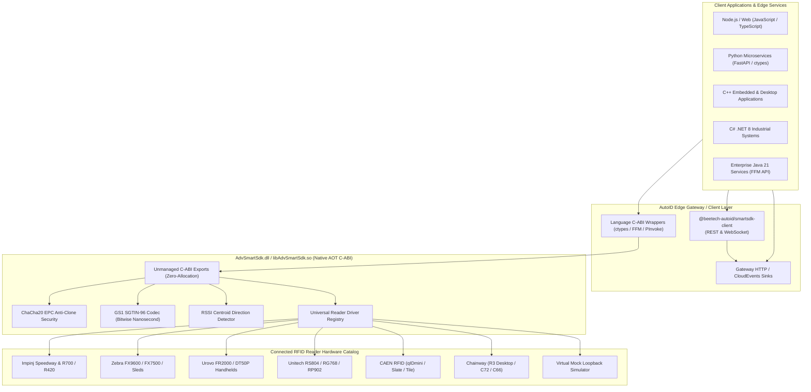

# advautoid.dev - Universal RFID & AutoID Developer Hub

[](https://github.com/anhdovan/advautoid.dev/actions)
[](https://advautoid.com)
[](https://advautoid.com/docs)
[](https://advautoid.com/trial)
[](LICENSE)
[]()
[]()
[]()

Welcome to **advautoid.dev**, the open-access developer portal, integration blueprints, and multi-language sample catalog for the **Beetech Universal RFID Adv.SmartSdk** and **AutoID Edge Gateway** platform. 

🌐 **Live Web Platform & Management**: [https://advautoid.com](https://advautoid.com)  
📖 **Interactive Web Documentation Hub**: [https://advautoid.com/docs](https://advautoid.com/docs)  
🔑 **Instant RSA-2048 Trial License Generator**: [https://advautoid.com/trial](https://advautoid.com/trial)

Whether you are building warehouse automation, logistics portals, manufacturing tracking, retail inventory, or smart gate validation, this repository provides complete guides, architectural specs, and runnable source code in **JavaScript**, **TypeScript**, **Python**, **C++**, **C# (.NET 8)**, and **Java (Java 21 FFM API)**.

---

## 🚀 Quick Navigation

| Section | Focus Area | Audience | Link |
| :--- | :--- | :--- | :--- |
| **Live Platform** | Online web portal & fleet control | All users | [advautoid.com](https://advautoid.com) |
| **Interactive Docs** | Web-based quickstart tabs, REST API tables & guide catalog | All developers | [advautoid.com/docs](https://advautoid.com/docs) |
| **Developer & SI Deck** | Online 1080p PPTX viewer & solutions guide (13 slides) | Developers & SIs | [Interactive Viewer](https://advautoid.com/docs) / [📥 PPTX](https://advautoid.com/downloads/smartsdk-for-developers-and-sis.pptx) |
| **Instant Trial** | Self-service 30-day offline RSA-2048 developer & pilot licenses | Evaluators & SIs | [advautoid.com/trial](https://advautoid.com/trial) |
| **Getting Started** | 5-minute quickstart, installation, reader discovery | All developers | [Quickstart Guide](docs/getting-started/quickstart.md) |
| **Developer Guide** | Core concepts, native C-ABI, ChaCha20 EPC crypto, GS1 SGTIN codec, portal direction | Application engineers | [Developer Guide](docs/developer-guide/core-concepts.md) |
| **Integrator Guide** | Edge deployment, Docker, CloudEvents webhooks, licensing, reader matrix | System integrators / DevOps | [Integrator Guide](docs/integrator-guide/architecture-overview.md) |
| **API Reference** | Native C-ABI exports, REST Gateway API, WebSocket tag stream | API consumers | [API Reference](docs/api-reference/c-abi.md) |
| **Code Samples** | Runnable code in JS, TS, Python, C++, C#, Java | Polyglot coders | [Samples Directory](samples/) |
| **Download Binaries** | Prebuilt unmanaged shared libraries (DLL, SO) | Developers & SIs | [Download Runtimes](runtimes/) |

---

## 📥 Download Prebuilt Native SDK Libraries (`AdvSmartSdk`)

The unmanaged core engine is compiled Ahead-of-Time (**Native AOT**) into standalone shared libraries with zero .NET runtime dependencies:

| Platform | File | Architecture | Direct Download | SHA-256 Checksum |
| :--- | :--- | :---: | :--- | :--- |
| **Windows** | `AdvSmartSdk.dll` | x64 | [📥 Download `AdvSmartSdk.dll`](https://github.com/anhdovan/advautoid.dev/raw/main/runtimes/win-x64/AdvSmartSdk.dll) | `E3292E0346B0AA07EA30A71AA0F29F403BA298E1E570BE324A9E7ECE305718ED` |
| **Linux** | `libAdvSmartSdk.so` | x64 | [📥 Download `libAdvSmartSdk.so`](https://github.com/anhdovan/advautoid.dev/raw/main/runtimes/linux-x64/libAdvSmartSdk.so) | `61A06A1424CEBD0FF365A51131A4D647086B11BF3028485761F5C937B60C5BFA` |
| **All Platforms** | `advautoid-sdk-bundle.zip` | Multi | [📦 Latest GitHub Release](https://github.com/anhdovan/advautoid.dev/releases/latest) | See release page |

*To learn how to load these binaries into C++, Python, C# P/Invoke, and Java 21, consult the [Runtimes Guide](runtimes/README.md).*

---

## 🏗️ Architectural Topology

The platform provides a 3-tier architecture separating hardware drivers, high-performance unmanaged execution, and high-level polyglot consumers:



---

## 💻 Language Code Samples Matrix

Explore end-to-end, runnable implementations across modern languages:

| Language | Core Tech / Wrapper | Description | Sample Location |
| :--- | :--- | :--- | :--- |
| **JavaScript** | Node.js / Browser WebSockets | Stream tags via WebSocket, receive CloudEvents webhooks, live HTML monitor | [`samples/javascript`](samples/javascript/) |
| **TypeScript** | `@beetech-autoid/smartsdk-client` | Type-safe gateway client, portal transit tracker, real-time reader control | [`samples/typescript`](samples/typescript/) |
| **Python** | `ctypes` & `requests` | Direct C-ABI binding, reader orchestration, ChaCha20 encryption, Flask webhook | [`samples/python`](samples/python/) |
| **C++** | C++17 Header & Dynamic Loader | Ultra-low latency native integration, unmanaged callback handler, CMake build | [`samples/cpp`](samples/cpp/) |
| **C#** | .NET 8 P/Invoke & High-level SDK | Enterprise C# sample with async pipelines, portal direction, hardware fingerprinting | [`samples/csharp`](samples/csharp/) |
| **Java** | Java 21 Foreign Function & Memory | Modern JNI-free C-ABI execution with `java.lang.foreign` | [`samples/java`](samples/java/) |

---

## ⚡ 60-Second Quickstart

### 0. Environment Bootstrap (Test vs. Production)

Before running client code, bring up the AutoID Edge Gateway and register your first reader:

```bash
# 1. Start Gateway Container (Test / Dev Mode with bypass):
docker run -d --name autoid-gateway -p 18080:18080 -e DEV_LICENSE_BYPASS=true beetech/autoid-gateway:latest

# (For Production: query fingerprint via curl http://localhost:18080/api/fingerprint,
#  subscribe at https://advautoid.com/trial, and mount smartsdk.lic into /app/license/smartsdk.lic)

# 2. Add a Reader (Virtual Mock simulator for testing or physical Impinj/Zebra):
curl -X POST http://localhost:18080/api/readers \
  -H "Content-Type: application/json" \
  -d '{"readerId": 1, "driverId": "mock", "name": "Sim 01", "address": "virtual:loopback", "powerDbm": 30.0, "antennas": [1, 2]}'
```

---

### 1. TypeScript / JavaScript (via NPM)
```bash
npm install @beetech-autoid/smartsdk-client
```
```typescript
import { SmartSdkClient } from '@beetech-autoid/smartsdk-client';

const client = new SmartSdkClient({ baseUrl: 'http://127.0.0.1:18080' });

// Listen for real-time tag reads & portal direction
client.subscribeTags((tag) => {
  console.log(`[TAG] EPC: ${tag.epc} | RSSI: ${tag.rssi} dBm | Ant: ${tag.antenna}`);
});

// Start inventory on Reader #1
await client.startReader(1);
```

### 2. Python (via Native C-ABI)
```python
from smart_sdk import SmartSdk

sdk = SmartSdk("AdvSmartSdk.dll")
sdk.set_dev_license_bypass(True)

with sdk.create_reader("mock", reader_id=1, address="virtual:loopback") as reader:
    reader.start_inventory(lambda tag: print(f"Tag read: {tag.epc}, RSSI: {tag.rssi}"))
```

### 3. C++17
```cpp
#include "AdvSmartSdk.h"

int main() {
    Beetech::Adv::AdvSmartSdk sdk("AdvSmartSdk.dll");
    sdk.Sdk_SetDevLicenseBypass(1);
    
    void* reader = nullptr;
    sdk.Sdk_CreateReader("mock", 1, "virtual:loopback", &reader);
    sdk.Sdk_Connect(reader);
    sdk.Sdk_StartInventory(reader);
}
```

---

## 📡 Supported Hardware Catalog

The SDK abstracts vendor proprietary protocols (LLRP, Impinj REST, Urovo Binary, CAEN ByteStream, Unitech API) into a unified programming model:

| Manufacturer | Models Supported | Communication Protocols | Supported Platforms |
| :--- | :--- | :--- | :--- |
| **Impinj** | Speedway R420, R220, R120, R700, Speedway Revolution | LLRP, REST API, MQTT, WebSockets | Windows x64, Linux x64 |
| **Zebra** | FX9600, FX7500, RFD40, RFD8500, RFD90, MC3300R | LLRP, RFID SDK, BLE, USB | Windows x64, Android |
| **Urovo** | FR2000, RF2000, DT50P, DT610, CT48 | TCP Socket, Serial/USB, Handheld Service | Windows x64, Android |
| **Unitech** | RS804, HT730, RG768, RP902 | LLRP, WebSocket, Serial, Android SDK | Windows x64, Android |
| **CAEN RFID** | qIDmini, Slate, Tile, Quattro, Quark | USB Virtual COM, Serial, Bluetooth | Windows x64, Linux |
| **Chainway** | R3 Desktop, C72, C66, C70 Handhelds | Serial COM, USB, Android UART | Windows x64, Android |
| **Virtual Mock** | Loopback Tag Generator & Direction Simulator | In-Memory Interop | All Platforms |

*For complete port configuration, baud rates, and antenna tuning, consult the [Supported Hardware Matrix](docs/integrator-guide/supported-hardware-matrix.md).*

---

## 📖 Complete Documentation Index

### Getting Started
- [Platform Prerequisites & Overview](docs/getting-started/index.md)
- [5-Minute Quickstart Walkthrough](docs/getting-started/quickstart.md)
- [Installation Guide (npm, NuGet, pip, Native)](docs/getting-started/installation.md)
- [Hardware Setup & Antenna Calibration](docs/getting-started/hardware-setup.md)

### Developer Guide
- [Core Architecture & Event Lifecycle](docs/developer-guide/core-concepts.md)
- [Native AOT C-ABI Specifications](docs/developer-guide/native-aot-c-abi.md)
- [ChaCha20 EPC Anti-Clone Cryptography](docs/developer-guide/epc-cryptography.md)
- [Zero-Allocation GS1 SGTIN-96 Codec](docs/developer-guide/gs1-sgtin-codec.md)
- [RSSI Centroid Portal Direction Tracking](docs/developer-guide/direction-detection.md)
- [Writing Custom Reader Driver Plugins](docs/developer-guide/custom-driver-plugin.md)

### Integrator Guide
- [System Architecture & Deployment Topologies](docs/integrator-guide/architecture-overview.md)
- [Docker Edge Gateway Deployment](docs/integrator-guide/edge-gateway-deployment.md)
- [CloudEvents Webhook Integration](docs/integrator-guide/cloudevents-webhook.md)
- [Hardware Compatibility Matrix](docs/integrator-guide/supported-hardware-matrix.md)
- [Hardware Fingerprinting & Cryptographic Licensing](docs/integrator-guide/licensing-and-fingerprinting.md)

### API References
- [C-ABI Function Signatures & Structs](docs/api-reference/c-abi.md)
- [Edge Gateway REST API Reference](docs/api-reference/rest-api.md)
- [WebSocket Live Tag Streaming Protocol](docs/api-reference/websocket-api.md)

---

## 🤝 Contributing

We welcome contributions from hardware manufacturers, system integrators, and independent developers!
To contribute driver modules, bug fixes, or documentation enhancements:
1. Fork this repository.
2. Create your feature branch (`git checkout -b feature/driver-x`).
3. Commit your changes and verify CI tests pass.
4. Open a Pull Request against `main`.

---

## 📄 License & Community Support

- **Live Platform & Web Portal**: [https://advautoid.com](https://advautoid.com)
- **Interactive Documentation**: [https://advautoid.com/docs](https://advautoid.com/docs)
- **Instant Trial License**: Generate your 30-day offline development license at [https://advautoid.com/trial](https://advautoid.com/trial)
- **Repository License**: [MIT License](LICENSE)
- **SDK Licensing**: Enterprise node-locked licensing with development bypass support. Generate instant trial licenses at [https://advautoid.com/trial](https://advautoid.com/trial) or consult the [Licensing Guide](docs/integrator-guide/licensing-and-fingerprinting.md).
- **Technical Support**: Submit GitHub issues or visit [https://advautoid.com](https://advautoid.com).
