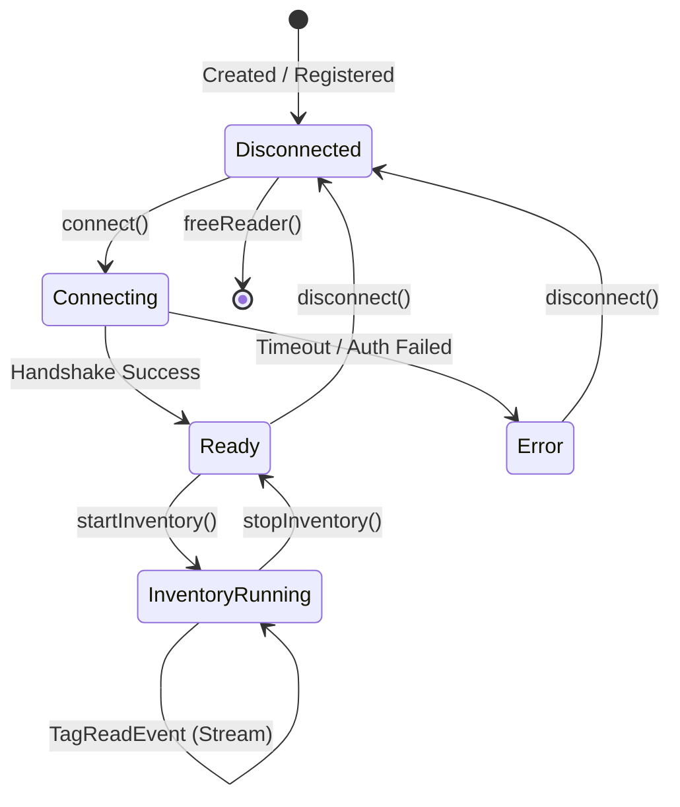
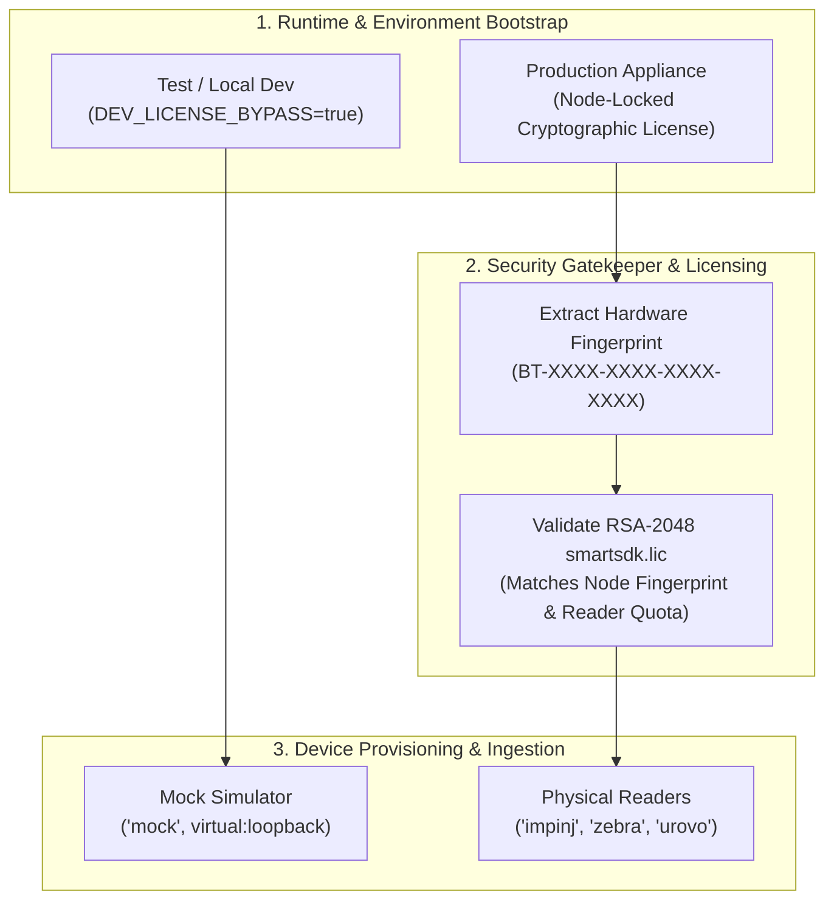

# Core Concepts & Event Lifecycle

Understanding the core objects, state machines, and concurrency models is essential for building robust industrial RFID systems.

---

## 1. Unified Reader Lifecycle

Every reader, regardless of whether it is an unmanaged native driver or an Edge Gateway virtual entity, adheres to a strict state machine:

### State Definitions
- **Disconnected**: Reader handle exists in memory; network socket or COM port is closed.
- **Connecting**: Active handshake, LLRP negotiation, or baud rate synchronization.
- **Ready**: Connected and idle. Hardware configuration (output power, frequency hops, session flags) can be applied.
- **InventoryRunning**: RF field energized. Tags backscattering in the field trigger asynchronous callbacks or WebSocket frames.
- **Error**: Network partition, antenna disconnect, or temperature alarm.

---

## 2. Tag Data Model (`TagReadItem`)

Every tag observation captures rich physical and temporal telemetry:

| Property | Type | Description | Example |
| :--- | :--- | :--- | :--- |
| `epc` | `string` | 24-character (96-bit) or 32-character (128-bit) hex EPC | `"E280116060000214B001ABCD"` |
| `rssi` | `number` / `int` | Received Signal Strength Indication in dBm | `-58` |
| `antennaPort`| `int` | 1-indexed antenna port on reader | `1` |
| `readerId` | `int` | Logical ID assigned to reader in gateway or engine | `1` |
| `timestamp` | `int64` / `ISO` | UTC millisecond hardware timestamp | `1774742400123` |
| `phaseAngle` | `double` | Carrier phase in radians `[0, 2π)` (if reader supports it) | `3.1415` |
| `doppler` | `double` | Doppler frequency shift in Hz (movement velocity) | `+12.4` |

---

## 3. High-Throughput Streaming & Zero Allocation

In high-density distribution centers, portals can read **1,200 tags per second**.

To avoid Garbage Collector pauses (in C# / Java / Node.js) and maximize throughput:
1. **Thread Separation**: Tag ingestion runs on dedicated high-priority native OS threads (`ThreadPriority.Highest`).
2. **Lock-Free Ring Buffers**: Events are transferred from hardware sockets into unmanaged ring buffers.
3. **Decoupled Sinks**: Dispatch to HTTP webhooks or disk spooling occurs asynchronously via worker thread pools.

---

## 4. Test vs. Production Execution Model

Developers and SIs must establish their execution environment before calling reader APIs:

### Environment Modes:
- **Test / Sandbox Mode**:
  - Run the Edge Gateway container with `-e DEV_LICENSE_BYPASS=true` or call `sdk.set_dev_license_bypass(True)` natively.
  - Allows instant local execution, automated CI unit testing, and mock device simulation without acquiring license keys.
- **Production Mode**:
  - Retrieve the host's 22-character hardware fingerprint (`curl http://localhost:18080/api/fingerprint` or `SmartSdkManager.GetHardwareFingerprint()`).
  - Subscribe for a trial at [advautoid.com/trial](https://advautoid.com/trial) or commercial license via the SI Portal.
  - Mount or supply `smartsdk.lic`; the runtime engine enforces node identity and reader concurrency quotas.

### Device Registration Strategy:
- **Offline / CI Testing**: Register virtual mock readers (`driverId: "mock"`, `address: "virtual:loopback"`) to simulate tag bursts, portal directions, and GPIO triggers with zero physical hardware.
- **Physical Commissioning**: Register vendor-certified drivers (`impinj`, `zebra`, `urovo`, `caen`, `unitech`) with network endpoints (`192.168.1.x:5084`).

