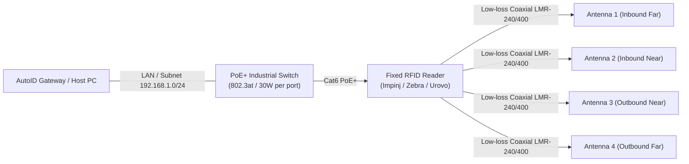

# Hardware Setup & Antenna Calibration

This guide covers physical installation, network topology, antenna wiring, and RF calibration for fixed, desktop, and handheld readers.

---

## 1. Network Topology & Power Over Ethernet (PoE)

Industrial RFID readers typically require **PoE+ (IEEE 802.3at)** to deliver sufficient RF power (up to +31.5 dBm) to 4 or 8 antenna ports.



### Cable Guidelines
- Use **LMR-195** for runs under 3 meters (loss: ~0.6 dB/m @ 915 MHz).
- Use **LMR-240** or **LMR-400** for runs exceeding 5 meters to prevent transmit and receive attenuation.
- Ensure all SMA / RP-TNC connectors are torqued properly (~5-8 in-lbs) and weather-sealed with vulcanizing tape in damp industrial environments.

---

## 2. Setting Up Impinj Speedway & R700 Readers

1. **IP Addressing**: Connect the reader's Ethernet port to your network. Impinj readers default to DHCP; if DHCP is unavailable, fallback is `169.254.1.1`.
2. **LLRP Protocol Port**: `5084` (Default unencrypted LLRP) or `5085` (TLS).
3. **Web Management**: Access `http://<reader-ip>` to verify firmware and view antenna status.
4. **Configuration in SDK**:
   ```json
   {
     "driverId": "impinj",
     "readerId": 1,
     "address": "192.168.1.150:5084",
     "powerDbm": 30.0,
     "sensitivityDbm": -70.0,
     "antennas": [1, 2, 3, 4]
   }
   ```

---

## 3. Setting Up Zebra FX9600 / FX7500 Readers

1. **Protocol**: Zebra readers communicate over standard LLRP or Zebra Native Host protocol.
2. **Default Credentials**: Default user `admin`, password `change`.
3. **Antenna Port Configuration**: Port 1 through 8.
4. **Configuration in SDK**:
   ```json
   {
     "driverId": "zebra",
     "readerId": 2,
     "address": "192.168.1.151:5084",
     "powerDbm": 29.5,
     "antennas": [1, 2, 3, 4, 5, 6, 7, 8]
   }
   ```

---

## 4. Setting Up Urovo FR2000 Fixed Readers

1. **Protocol**: High-speed TCP socket or RS-232/USB serial.
2. **Default Network**: Default IP `192.168.1.116`, Port `8088` (or `6000`).
3. **Configuration in SDK**:
   ```json
   {
     "driverId": "urovo",
     "readerId": 3,
     "address": "192.168.1.116:8088",
     "powerDbm": 27.0,
     "antennas": [1, 2, 3, 4]
   }
   ```

---

## 5. Setting Up Desktop & Handheld Sleds

### CAEN RFID (qIDmini, Tile, Slate)
- **Interface**: USB Virtual COM port or Bluetooth SPP.
- **Address format**: `COM3:115200` or `COM5:921600`.

### Chainway R3 Desktop
- **Interface**: USB Virtual COM port.
- **Address format**: `COM4:115200`.

### Handheld Sleds (Zebra RFD40/RFD8500, Urovo DT50P, Unitech RG768)
- Connected to Android host terminals via 8-pin pogo pin or Bluetooth BLE.
- When running Android Gateway, the SDK connects over internal local IPC or Bluetooth RFCOMM.

---

## 6. Portal Antenna Orientation for Direction Detection

To achieve >99% statistical accuracy in transit direction detection (`In-to-Out` vs `Out-to-In`):

```
          [ INBOUND ZONE ]
                 ▲
   Antenna 1            Antenna 3   (Facing Inward, Angle: 30° - 45°)
   [Port 1]             [Port 3]
       │                    │
       │     GATEWAY ZONE   │
       │                    │
   [Port 2]             [Port 4]
   Antenna 2            Antenna 4   (Facing Outward, Angle: 30° - 45°)
                 ▼
          [ OUTBOUND ZONE ]
```

- **Antennas 1 & 3** represent the **Inside Zone**.
- **Antennas 2 & 4** represent the **Outside Zone**.
- As an asset moves through the portal, the RSSI centroid transitions smoothly from `{Ant1, Ant3}` to `{Ant2, Ant4}`, producing an unequivocal vector for the Direction Detector.
