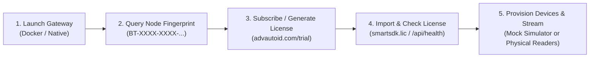

# Getting Started Overview

Welcome to the **advautoid.dev** Getting Started guide. This section provides everything needed to establish your first RFID reader connection, process real-time tags, and deploy the SDK across environments.

> 🌐 **Live Web Platform**: Test the live RFID simulator and manage trial licenses on the official portal at [https://advautoid.com](https://advautoid.com) (or explore [https://advautoid.com/docs](https://advautoid.com/docs)).

---

## 🧭 Navigation

- [Quickstart Tutorial](quickstart.md): Build and run a 5-minute RFID streaming sample.
- [Installation Guide](installation.md): Packages, binaries, Docker images, and dependencies.
- [Hardware Setup](hardware-setup.md): Wiring, network setup, and antenna tuning for Impinj, Zebra, Urovo, and more.
- [Online Presentation Viewer](https://advautoid.com/docs): 13-slide architectural and solutions walkthrough for Developers & SIs.

---

## ⚡ The 5-Step Getting Started Workflow

Regardless of language or deployment model, every user must follow this operational chain to start streaming RFID data:

1. **Run the Environment (Test vs. Prod)**:
   - *Test / Sandbox*: Launch Edge Gateway container with `-e DEV_LICENSE_BYPASS=true` for instant zero-friction mock evaluation.
   - *Production*: Deploy container with persistent volumes (`./config`, `./license`, `./spool`) and host network mode.
2. **Retrieve Machine Hardware Fingerprint**:
   - Query `GET /api/fingerprint` or call `Sdk_GetHardwareFingerprint()` to obtain the cryptographic node fingerprint (`BT-XXXX-XXXX-XXXX-XXXX`).
3. **Subscribe & Issue License**:
   - Access **[advautoid.com/trial](https://advautoid.com/trial)** or the SI Enterprise Licensing Portal to generate an RSA-2048 digitally signed license.
4. **Import & Verify License**:
   - Mount `smartsdk.lic` into `/app/license/` and check `GET /api/health` to confirm reader quotas and validity.
5. **Add Devices & Stream Tags**:
   - Add virtual mock simulators or connect physical readers (Impinj, Zebra, Urovo) via `POST /api/readers` or `config/readers.json`, then subscribe via WebSocket, SDK, or CloudEvents webhook.

---

## 🎯 Architecture At a Glance

The AutoID platform enables developers to work at two primary levels:

1. **Edge Gateway Level (REST / WebSocket / Webhooks)**:
   - Run the AutoID Edge Gateway as a Docker container or Windows/Linux service.
   - Connect web dashboards, mobile apps, or backend microservices over HTTP/WebSocket.
   - Use the official client library: `@beetech-autoid/smartsdk-client`.

2. **Native Embedded Level (C-ABI Shared Library)**:
   - Directly link against `AdvSmartSdk.dll` (Windows) or `libAdvSmartSdk.so` (Linux).
   - Zero runtime overhead, nanosecond EPC encoding/decoding, native hardware callbacks.
   - Supported languages: C#, C++, Python, Java 21 (FFM), Rust, Go.

---

## 📦 SDK Deliverables

| Artifact | Format | Description |
| :--- | :--- | :--- |
| **Edge Gateway** | Docker Image / Win Service | Standalone gateway managing physical readers and publishing REST / WebSocket / CloudEvents |
| **Native Engine** | `AdvSmartSdk.dll` / `.so` | Native AOT unmanaged shared library exposing C-ABI |
| **NPM Client** | `@beetech-autoid/smartsdk-client` | Idiomatic TypeScript / JavaScript SDK |
| **Python Client** | `smart_sdk.py` | Native `ctypes` wrapper and async streaming helpers |
| **C++ Header** | `AdvSmartSdk.h` | Modern C++17 RAII wrapper and function pointer bindings |
| **C# Client** | `Beetech.Adv.SmartSdk.dll` | Managed .NET 8 wrapper with async enumerables and LINQ |

