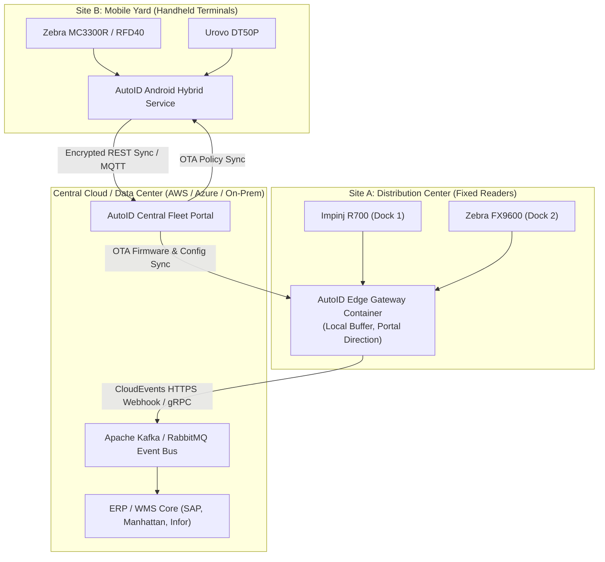

# Enterprise Architecture Overview

Modern enterprise RFID installations span distributed facilities: manufacturing plants, automated distribution centers, retail stores, and transport hubs.

The **Adv.SmartSdk** architecture supports three primary deployment topologies:

---

## 1. Topologies

---

## 2. Resilience & Offline Spooling

Industrial networks frequently experience transient switch reboots or WAN outages.

1. **Local Persistent Spooling**:
   - When upstream network connections fail, the Edge Gateway immediately diverts tag events to a local write-ahead log (SQLite / binary spool).
   - Zero tag loss during up to 72 hours of complete network disconnection.
2. **Backpressure & Automatic Replay**:
   - As soon as connectivity is restored, the Gateway replays buffered events in exact chronological order with their original hardware millisecond timestamps.
3. **Health Monitoring & Auto-Restart**:
   - Built-in watchdog services automatically restart failed reader connections and report telemetry to the Fleet Portal.
