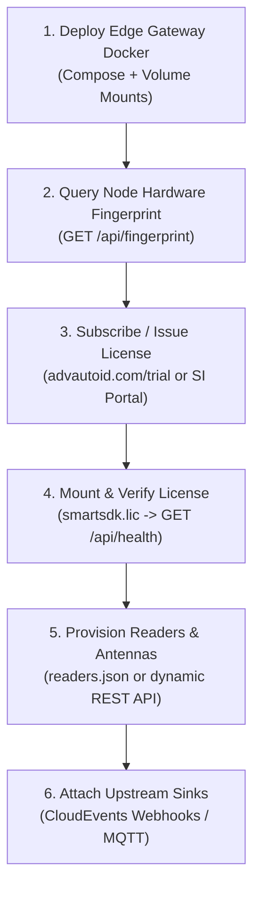

# Integrator Guide

The Integrator Guide is intended for System Integrators (SIs), Solution Architects, and DevOps engineers deploying AutoID RFID systems in commercial and industrial settings.

> 🌐 **Live Web Platform**: Visit [https://advautoid.com](https://advautoid.com) | [Documentation Hub](https://advautoid.com/docs)

---

## 🚀 SI Deployment & Commissioning Roadmap

Every production deployment follows this streamlined integration sequence:

---

## 📑 Guide Sections

1. [Architecture Overview](architecture-overview.md)  
   Enterprise deployment topologies: On-premise Edge Gateways, Cloud-managed Fleet Portals, and Hybrid Android terminals.

2. [Docker Edge Gateway Deployment](edge-gateway-deployment.md)  
   Step-by-step commissioning runbook: Docker Compose setup, node fingerprinting, license import, device provisioning, and healthchecks.

3. [Licensing & Hardware Fingerprinting](licensing-and-fingerprinting.md)  
   Node-locked hardware fingerprinting (`BT-XXXX-XXXX-XXXX-XXXX`), RSA cryptographic license validation, and dev bypass modes.

4. [CloudEvents Webhook Integration](cloudevents-webhook.md)  
   Integrating with ERP, WMS, and MES platforms via CNCF CloudEvents standard JSON over HTTPS webhooks.

5. [Supported Hardware Compatibility Matrix](supported-hardware-matrix.md)  
   Exhaustive matrix of tested fixed readers, handheld sleds, desktop readers, and communication protocols.

