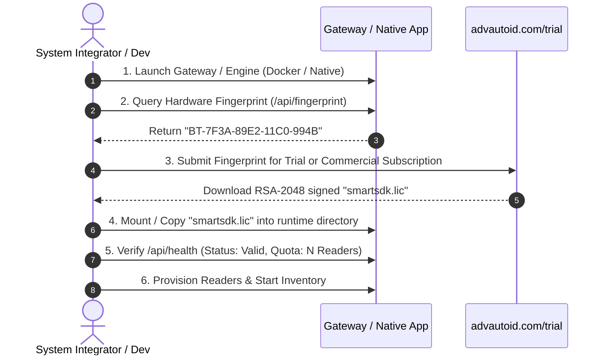

# Licensing & Hardware Fingerprinting

The **Adv.SmartSdk** incorporates a cryptographic node-locking licensing system to protect enterprise IP while providing seamless activation for system integrators and developers.

---

## 🔄 End-to-End Licensing Lifecycle



---

## 1. Hardware Fingerprinting (`BT-XXXX-XXXX-XXXX-XXXX`)

The SDK generates a deterministic hardware fingerprint derived from physical, non-volatile machine identifiers:
- Motherboard UUID and BIOS Serial Number
- CPU Processor ID
- Primary Disk Drive Physical Serial Number

The fingerprint format is strictly 22 characters: `BT-XXXX-XXXX-XXXX-XXXX`.

### Querying Hardware Fingerprint

#### Method A: Via Edge Gateway REST API (Recommended for Docker / Containers)
```bash
curl http://localhost:18080/api/fingerprint
```
*Response:*
```json
{
  "hardwareFingerprint": "BT-7F3A-89E2-11C0-994B"
}
```

#### Method B: Via TypeScript Client SDK
```typescript
import { SmartSdkClient } from '@beetech-autoid/smartsdk-client';

const client = new SmartSdkClient({ baseUrl: 'http://localhost:18080' });
const fp = await client.getFingerprint();
console.log(`Machine Fingerprint: ${fp}`);
```

#### Method C: Via Python (`ctypes` Native Engine)
```python
from smart_sdk import SmartSdk

sdk = SmartSdk("AdvSmartSdk.dll")
fp = sdk.get_hardware_fingerprint()
print(f"Machine Hardware Fingerprint: {fp}")
# Example output: BT-7F3A-89E2-11C0-994B
```

#### Method D: Via C# (.NET 8)
```csharp
using Beetech.Adv.SmartSdk;

string fp = SmartSdkManager.GetHardwareFingerprint();
Console.WriteLine($"Hardware Fingerprint: {fp}");
```

#### Method E: Via C++
```cpp
#include "AdvSmartSdk.h"
#include <iostream>

int main() {
    Beetech::Adv::AdvSmartSdk sdk("AdvSmartSdk.dll");
    char fp[64] = {0};
    sdk.Sdk_GetHardwareFingerprint(fp, sizeof(fp));
    std::cout << "Hardware Fingerprint: " << fp << std::endl;
}
```

---

## 2. Subscribing for a License

Once you have your hardware fingerprint:

1. **Free 30-Day Instant Developer Trial**:
   - Visit the self-service trial portal: **[https://advautoid.com/trial](https://advautoid.com/trial)**
   - Enter your fingerprint `BT-XXXX-XXXX-XXXX-XXXX` and email address.
   - Download the generated `smartsdk.lic`.
2. **Commercial & Enterprise Subscription**:
   - Access the SI Fleet Portal at [https://advautoid.com](https://advautoid.com) or contact your Beetech account manager.
   - Issue node-locked licenses with designated reader quotas (e.g. 2, 4, 8, or Unlimited Readers) and feature flags.

---

## 3. Importing & Checking License

### Docker Edge Gateway
Mount the license file into `/app/license/smartsdk.lic`:
```yaml
services:
  autoid-gateway:
    image: beetech/autoid-gateway:latest
    environment:
      - DEV_LICENSE_BYPASS=false
      - LICENSE_FILE=/app/license/smartsdk.lic
    volumes:
      - ./license:/app/license:ro
```

Verify license status via REST API:
```bash
curl http://localhost:18080/api/health
```
*Expected response when licensed:*
```json
{
  "status": "Healthy",
  "version": "1.0.0",
  "engine": "Native AOT C-ABI",
  "licenseStatus": "Valid",
  "licensedTo": "Acme Industrial Logistics",
  "allowedReaders": 8,
  "activeReaders": 2,
  "validUntil": "2027-12-31T23:59:59Z"
}
```

### Native Embedded Applications (C++, Python, C#)
Place `smartsdk.lic` directly in your application's current working directory or pass its path to the validation API:

```python
is_valid, err_msg = sdk.validate_license("smartsdk.lic")
if not is_valid:
    print(f"License verification failed: {err_msg}")
else:
    print("License verified successfully.")
```

---

## 4. Developer Bypass Mode (Test & CI Environments)

During local development, automated CI test suites, or initial sandbox testing without hardware, you can bypass cryptographic license validation:

### In Docker Edge Gateway:
```bash
docker run -d \
  -p 18080:18080 \
  -e DEV_LICENSE_BYPASS=true \
  beetech/autoid-gateway:latest
```

### In Native Python Engine:
```python
sdk = SmartSdk("AdvSmartSdk.dll")
sdk.set_dev_license_bypass(True)
```

> [!WARNING]
> Developer bypass mode is strictly intended for evaluation, sandbox prototyping, and offline testing. Production reader fleets require authenticated node-locked licenses.


